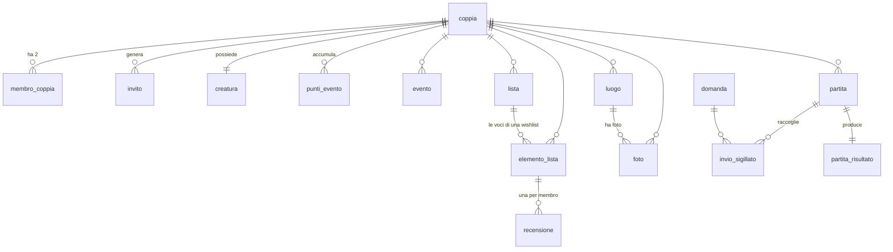

# LifeCouple — Architecture

Architettura completa, con **trade-off** e **alternative scartate col loro costo**. Obblighi di contenuto: [`Rule/regole-sviluppo-sicuro.md`](../../../Rule/regole-sviluppo-sicuro.md) §1.2.

> **Stato al 2026-08-12**: architettura **progettata, non implementata**. Nessun componente esiste. Ciò che segue è il disegno da cui partirà il codice, non una descrizione di ciò che c'è.

> ⟳ **Stato al 2026-09-14 (2)**: la riga qui sopra resta com'era scritta, e **non descrive più il sistema**. Le migrazioni sono arrivate alla `0042`, le Edge Function sono **tre**, le notifiche push sono state ricevute su un telefono vero e la catena dei pagamenti esiste per intero.
>
> 🔑 **Questo documento è stato allineato al codice il 2026-09-14**, dopo due giornate in cui erano nati due sottosistemi interi — notifiche e pagamenti — che qui non comparivano. ⚠️ *È la stessa forma di difetto che il progetto insegue da settimane: una frase vera quando è stata scritta, resa falsa da un lavoro fatto altrove. Ma questa non poteva essere intercettata da nessun controllo — **un documento che tace su un componente compila, passa i test e non fallisce niente**.*

> ⟳ **Riallineato di nuovo il 2026-09-15 (5), e la riga qui sopra si è avverata su se stessa in un giorno solo.** Nessuno dei **cinque commit** del 2026-09-15 ha toccato questo file, mentre quel giorno cambiava **il cancello del diritto** (`0047`), **il modo in cui il diritto arriva al telefono** (`0048`) e nasceva **una superficie d'ingresso nuova** (l'universal link, D-137).
>
> 🔴 **Il punto peggiore era §5, flusso 6**: descriveva come funzionamento normale i *«sei tentativi in ~9 secondi»* che il giorno prima erano stati **rimossi in quanto difetto** (B-77). ⚠️ *Un documento che descrive il meccanismo sbagliato non è incompleto: manda a cercare nel posto sbagliato.*
>
> 🔑 **E la causa non è distrazione, è struttura**: `tsc`, `eslint` e i test diventano rossi quando il **codice** si contraddice, e non hanno niente da dire quando è un **documento** a contraddire il codice. Finché quella asimmetria resta, questo file va riletto **ogni volta che una migrazione cambia una funzione o un flusso** — è un passo di fine lavoro, non un controllo automatico. *La stessa forma di B-78.*

---

## 1. Componenti e responsabilità

| Componente | Responsabilità | Dove gira |
|---|---|---|
| **App mobile** (React Native + Expo) | Interfaccia, cattura foto, inserimento luoghi, compressione lato client | Telefono dell'utente |
| **Auth** (Supabase Auth) | Registrazione, login, sessione, token | Supabase, regione UE |
| **Database** (Postgres con RLS) | Coppie, membri, eventi, luoghi, elementi delle liste, metadati foto | Supabase, regione UE |
| **Storage** (Supabase Storage) | File delle fotografie | Supabase, regione UE |
| **Policy RLS** | **Il controllo di autorizzazione vero**: chi vede quale riga | Dentro il database |
| **Macchina della partita** | Condivisa da **tutti e quattro** i giochi: partita → entrambi pronti → round → «continua» in due → conclusa, col punteggio. Scritta una volta (`usePartita`, migrazioni 0020 e 0027) | Database + app |
| **Invio sigillato** | Il congegno di **tre** giochi su quattro (quiz, telepatia, disegno): invio segreto di entrambi → **rivelazione solo quando entrambi hanno inviato**. Il confronto avviene in una **funzione Postgres**, mai nel client. ⚠️ «Obbligo o verità» **non lo usa** (D-86): la carta la devono leggere tutti e due, quindi non c'è nessun segreto da proteggere | Database |
| **Creatura — stato** | Punti di crescita, stadio derivato, umore. **Non sa come viene disegnata** | Database + app |
| **Creatura — disegno** | Riceve `stadio` e `umore`, restituisce il visivo. **Non sa da dove vengono** | App |
| **Coda delle notifiche** | Raccoglie ciò che va notificato nel momento in cui accade, e conserva l'esito di ogni invio. ⚠️ **Nessun client la legge e nessuno la scrive** (§4.3-bis) | Database (`0038`, `0039`) |
| **Edge Function** (tre) | L'unica logica che gira **fuori** dal database e **fuori** dal telefono, perché serve la chiave `service_role` (§4.3-ter) | Supabase, regione UE |
| **Diritto a «Insieme»** | Chi ha pagato e fino a quando, e la sua **proiezione sulla coppia**. 🔑 **È il cancello delle funzioni a pagamento**, e lo legge il database — mai l'app (§4.3-quater) | Database (`0041`) |
| **RevenueCat** (SDK + pannello) | Acquisti, ricevute, listino, ripristino, stato dell'abbonamento. ⚠️ **Non decide niente**: ciò che sa serve a *disegnare la schermata* | Telefono + fornitore, **Stati Uniti** |
| **Landing** (`landing/`, CloudFront + S3) | ⟳ **Dal 2026-09-15 non è più solo una vetrina**: serve i documenti legali pubblici (obbligo di store) e il file `.well-known/apple-app-site-association` che **iOS legge per decidere se aprire l'app** su un link d'invito (§5, flusso 7). 🔑 *Da quel giorno un pezzo del funzionamento dell'app dipende da un file statico su un CDN*, e la 404 è parte del percorso di acquisizione, non una pagina di errore | AWS (S3 + CloudFront) |

> **Il confine fra questi due ultimi componenti è una decisione di architettura, non un dettaglio di implementazione** (D-09). È ciò che rende sostituibile il disegno senza toccare la logica: si parte con `react-native-svg` + Reanimated e si arriva, quando ha senso, a file **Lottie** consegnati da un illustratore — stessa interfaccia, renderer diverso. Se la logica di crescita conoscesse le forme, la sostituzione costerebbe quanto rifare la funzione.
>
> **Vincolo collegato**: **~5-6 stadi discreti**, non una scala continua. Il costo dell'upgrade grafico cresce linearmente col numero di stati visivi: pochi stadi si possono far illustrare, molti no — e la versione elaborata non arriverebbe mai.

Non esiste un backend applicativo scritto da noi. L'app parla direttamente con Supabase, e **l'autorizzazione vive nel database**.

**Trade-off dichiarato**: senza un livello server nostro, ogni regola di autorizzazione che dimentichiamo di scrivere come policy RLS **non esiste** — non c'è un secondo strato che la recuperi. In cambio si eliminano un servizio da scrivere, da deployare e da mantenere (V1) e il suo costo (V2). Contropartita accettata: le policy RLS diventano l'artefatto più critico del progetto e vanno testate come tale (§7).

> ⟳ **Dal 2026-09-14 la prima frase ha tre eccezioni, non zero**: `cancella-account`, `invia-notifiche` e `abbonamento-webhook`. Resta vero ciò che conta — **nessuna di esse sta fra l'app e i dati della coppia**, che continuano a passare per la RLS — ma sono codice nostro che gira con la `service_role`, e per **due di esse il chiamante non è una persona**. Perché esistano solo loro, e perché quel confine sia il posto giusto dove fermarsi, è in §4.3-ter.

---

## 2. Confini di fiducia

Sono **cinque** dal 2026-09-14, e il secondo è quello che rende questa app diversa da un'app qualsiasi.

| # | Confine | Da cosa a cosa |
|---|---|---|
| **TB-1** | Utente ↔ backend | Il telefono è ostile per definizione: chiunque può parlare all'API con un token valido e chiedere righe non sue |
| **TB-2** | **Partner ↔ partner** | I due membri della coppia **non sono la stessa entità di fiducia**. Condividono contenuti ma non identità |
| **TB-3** | Coppia ↔ coppia | I dati di una coppia non devono essere raggiungibili da un'altra |
| **TB-4** | Sistema ↔ servizio push (**fuori dall'UE**) | ⟳ **Aggiunto il 2026-09-14 con D-129.** Il testo di una notifica lascia la nostra infrastruttura e passa da **Expo**, poi da **Apple (APNs)** o **Google (FCM)**, negli Stati Uniti |
| **TB-5** | Sistema ↔ diritto a pagamento (**fuori dall'UE**) | ⟳ **Aggiunto il 2026-09-14 con D-133.** Chi paga è il telefono, che resta ostile per definizione: il diritto lo scrive **solo** il webhook, e l'identificativo dell'utente arriva a **RevenueCat**, negli Stati Uniti |

> 🔑 **TB-4 non esisteva perché fino al 2026-09-13 nessun contenuto della coppia usciva dall'UE**, e il registro art. 30 lo dichiarava. Le notifiche l'hanno creato: il ricordo «N anni fa» porta con sé **il titolo dell'evento**. ⚠️ *È l'unico contenuto che esce* — fotografie, note, diario, posizione e account no — e **chi spegne le notifiche non fa uscire niente**, il che rende il confine attraversabile solo per scelta. La conseguenza sul testo delle notifiche è in `threat-model.md` §4-bis, non qui: è una decisione di sicurezza, non di struttura.

> 🔑 **TB-5 non è «i pagamenti», ed è una cosa molto più stretta.** Il denaro non passa da noi in nessun momento — incassa Apple, RevenueCat normalizza, noi scriviamo **un booleano** — quindi questo confine non protegge un pagamento: protegge *chi può accendere quel booleano*. ⚠️ *È la ragione per cui la sua tabella nel threat model (§4-ter) è più corta di quanto la parola «pagamenti» faccia temere, e per cui ciò che esce dall'UE è un identificativo, non un dato di pagamento.*

> ⚠️ **TB-2 è il confine caratteristico di questo prodotto, ed è quello che le app di coppia trattano peggio.** L'assunzione implicita di quasi tutte è *"sono una coppia, quindi si fidano"*. È vera finché è vera. L'architettura non deve dipendere da quell'assunzione: deve funzionare correttamente **anche quando smette di essere vera**, senza migrazioni d'emergenza su dati che nel frattempo sono diventati contesi.

---

## 3. Stack, con la motivazione di ogni scelta

| Scelta | Perché | Alternativa scartata e suo costo |
|---|---|---|
| **React Native + Expo** | Un codice per iOS e Android; accesso nativo a galleria, mappa e notifiche | **Web app**: zero store e zero review, ma niente push affidabili su iOS e niente accesso fluido alla galleria — e non insegna il passaggio "review dello store", che è parte dell'obiettivo. **Nativo separato**: due codebase per una persona sola su un progetto non core |
| **Supabase** (auth + Postgres + storage) | Tre pezzi in un servizio, piano gratuito iniziale, e la RLS come controllo di autorizzazione nel database | **AWS**: più controllo, IAM verificabile con `simulate-principal-policy`, coerenza con HeleoX — ma sproporzionato a quattro funzioni CRUD, e allunga i tempi (viola V1 e V2). **Locale peer-to-peer**: privacy per costruzione e costo zero, ma la sincronizzazione fra due dispositivi è il pezzo più difficile dell'intero progetto e non c'è backup |
| **Row Level Security come autorizzazione primaria** | Se la query applicativa è sbagliata, il dato **non esce lo stesso** | **Controllo solo nel codice dell'app**: gratis da scrivere, ma un client compromesso o una query dimenticata espone tutto. Inaccettabile con foto intime |
| **Regione UE** obbligatoria | Dati personali di residenti UE, e un trasferimento extra-UE aprirebbe un capitolo (clausole contrattuali tipo) sproporzionato al progetto | Regione USA: nessun vantaggio, costo di conformità reale |
| **Mappa: inserimento manuale** | Vedi `History.md` D-05 | Check-in automatico: più comodo, ma trasforma l'app in un tracker di persona |
| **Foto compresse lato client** | È l'unica funzione a costo non limitato (V2) | Caricamento dell'originale: qualità migliore, ma satura il piano gratuito in mesi |
| **RevenueCat** (`react-native-purchases`) per gli acquisti — **dal 2026-09-14, D-133** | Validazione delle ricevute, rinnovi, ripristino, stato normalizzato e webhook: è la parte che costa di più da tenere in piedi, e **nessuna di quelle cose è il prodotto** | **`react-native-iap`**: nessun fornitore in mezzo e nessun identificativo fuori dall'UE, ma **validazione delle ricevute e webhook da scrivere e mantenere in proprio**. ⚠️ *La conseguenza pesa più della scelta*: è un **modulo nativo**, quindi da qui in poi Expo Go non basta e serve una development build — ed è lo stesso gesto che sbloccava le altre tre cose che lo aspettavano |

### 3-bis. Strato di sviluppo e UI (deciso il 2026-08-12)

Scelto sotto due vincoli espliciti dell'utente: **scrivere meno codice possibile** e **investire il tempo risparmiato sulla UI**.

| Strato | Scelta | Perché |
|---|---|---|
| Routing | **expo-router** | Routing per file: nessuna configurazione di navigazione da scrivere |
| Stile | **NativeWind** | Tailwind dentro React Native, compilato in anticipo (nessun costo a runtime) |
| Componenti | **React Native Reusables** | Porting diretto di **shadcn/ui** su RN, modello copia-e-incolla: entra solo ciò che si usa, e il codice è proprio da subito |
| Movimento | **Reanimated + Moti** | Moti è l'API dichiarativa sopra Reanimated: un'animazione è una prop |
| Creatura | **PNG + Reanimated**, con dissolvenza incrociata fra umori | ⟳ **Cambiato il 2026-09-06 (D-103)**: era `react-native-svg`, ma il disegno arriva da un modello generativo e produce raster (D-95). Il difetto della strada raster — *non cambia espressione dentro l'animazione* — lo paga **D-102**, che vincola l'umore a cambiare **solo la riga dell'espressione**: le tre immagini di uno stadio restano sovrapponibili, quindi si incrociano in dissolvenza. ⚠️ Il passaggio a Lottie resta possibile senza toccare la logica: il componente riceve sempre e solo `stadio` e `umore` (D-09) |
| Tipi | **`supabase gen types typescript`** | I tipi si **generano dallo schema**: zero tipi a mano, e uno schema che cambia rompe il build invece dell'app |
| Dati e cache | **TanStack Query** | Toglie la gran parte del codice di stato: caricamento, errore, refetch, cache |
| Icone | **lucide-react-native** | Stesso set di shadcn: coerenza visiva senza lavoro |
| Mappa | **react-native-maps** | Apple Maps su iOS, Google Maps su Android, entrambi nativi |
| Foto | **expo-image-picker + expo-image-manipulator** | Compressione lato client richiesta dal vincolo di costo |
| Liste | **FlashList** | Sostituisce FlatList senza riscrivere nulla |

**Alternative scartate, col loro costo**

- **Tamagui** — tecnicamente il più forte: un compilatore appiattisce gli stili e sul native va quasi come React Native puro. Ma **il suo vantaggio è la prestazione, e la prestazione non è il vincolo qui**: quattro schermate CRUD e due utenti. In cambio chiede di imparare un'API di stile proprietaria e poco trasferibile. Contro V1 (meno tempo), perde.
- **gluestack-ui** — ottima seconda scelta, filosofia copia-e-incolla e base NativeWind identiche. Scartata per un motivo di **leva**, non di qualità: vedi sotto.

**Il motivo di fondo della scelta shadcn, che vale più della singola libreria**: l'ecosistema di UI generabile o riusabile (v0, 21st.dev, Tailwind UI, l'intero mondo shadcn) produce **React web + Tailwind**. Scegliendo mobile si perde quella leva. Adottare **la forma shadcn + Tailwind anche su native** ne recupera la maggior parte: stessi nomi di classe, stessi nomi di componente, stessa struttura — un componente trovato o generato non si incolla, ma **si traduce quasi meccanicamente** invece di essere riprogettato. È il vero motivo per preferire React Native Reusables a gluestack: non è più bello, è **più vicino a ciò che gli strumenti sanno produrre**.

**Dove va speso il tempo risparmiato** (decisione di progetto, non consiglio generico): componenti standard presi dalla libreria **senza toccarli** — form, bottoni, input, sheet — perché sono il 70% delle schermate e nessuno li guarda; tutto il tempo risparmiato su **tre schermate**: mappa dei ricordi, griglia foto, apertura. Più due cose che costano quasi nulla e cambiano la percezione più della libreria scelta: **token definiti prima** (una scala tipografica, una di spazio, due accenti) e un **font non di sistema** via `@expo-google-fonts`.

### 3-ter. Cosa è cambiato costruendolo davvero (verificato il 2026-08-27)

La tabella qui sopra è **la decisione del 2026-08-12**, presa prima di scrivere codice, e resta scritta com'era. Questa sezione dice **com'è andata**: tre librerie previste non sono mai entrate, e una quarta è stata usata in modo diverso da come era stata immaginata. Sono divergenze fra piano e realtà — dichiararle è obbligatorio (`regole-sviluppo-sicuro.md`, principio 7: nessun gap silenzioso), perché una tabella di stack che elenca librerie assenti fa perdere mezz'ora a chiunque la legga per capire dove sono.

| Previsto | Realtà al 2026-08-27 | Perché |
|---|---|---|
| **Moti** (API dichiarativa sopra Reanimated) | **Mai installato.** Si usa **Reanimated 4 direttamente**, più uno strato di movimento nostro | Moti risolve *«scrivere un'animazione in una prop»*. Il problema vero, emerso costruendo, era un altro: **far muovere tutta l'app allo stesso modo**. Una prop dichiarativa non impedisce a due schermate di usare due molle diverse; un file di token sì. Vedi D-53 |
| **TanStack Query** | **Mai installato.** I dati stanno in hook nostri (`lib/eventi.ts`, `lib/luoghi.ts`, `lib/preferiti.ts`, `lib/evento-dettaglio.ts`) | Non è stata una scelta: è successo. Ogni hook è nato per una schermata, e quando si è visto che facevano tutti la stessa cosa, funzionavano già. **È un debito, non un merito** — vedi §7.5 |
| **FlashList** | **Mai installata.** Si usa `FlatList` | Non è mai servita. Le liste vere hanno le decine di elementi, non le migliaia; l'unica lunga — la striscia dei giorni, 730 celle — regge benissimo con `getItemLayout`, che le dà le posizioni **senza misurare** (ed è ciò che ha chiuso B-06) |
| **`supabase gen types typescript`** | ⟳ **Rigenerato il 2026-09-14, e il debito è chiuso.** Fino a quel giorno `lib/database.types.ts` aveva **blocchi scritti a mano**, dalla `0011` in poi | 🔑 *Rigenerandolo è emerso un difetto in `lib/partita.ts`, un file **non toccato**, che compilava solo perché i tipi a mano dicevano una cosa diversa dallo schema vero.* ⚠️ **È la prova del debito**: un tipo scritto a mano non descrive il database, lo **contraddice in silenzio** — e finché lo contraddice, il compilatore dà ragione alla copia sbagliata |

**Lo strato di movimento** che ha preso il posto di Moti (D-53, 2026-08-27):

| File | Responsabilità |
|---|---|
| `lib/movimento.ts` | I **token**: tre molle (`tocco` rigida, `entrata` morbida, `scivolo` in mezzo), le durate per ciò che sfuma, la cascata col suo tetto, il riscontro tattile |
| `components/ui/premibile.tsx` | Il cedimento sotto il dito, uguale per ogni comando dell'app |
| `components/ui/comparsa.tsx` | Entrata **e uscita**, con smontaggio ritardato — la metà che manca sempre |

> **Perché sta in architettura e non solo in `History.md`**: è la stessa scelta di `lib/tema.ts` per i colori, e ha la stessa conseguenza strutturale. Un componente nuovo che si anima da sé è libero di divergere; uno che legge da qui non può. La regola operativa è: **nessun `withSpring` con numeri scritti sul posto** — se serve una molla nuova, si aggiunge a `lib/movimento.ts` con la sua ragione.

---

## 4. Il modello dati, e perché la sua forma è una decisione di sicurezza

> **Schema disegnato il 2026-08-12**, dopo la chiusura delle quattro decisioni bloccanti (D-14…D-17). Copre **tutte** le funzioni, creatura e giochi inclusi, anche se l'implementazione le rimanda in fondo (D-11).

### 4.1 Le tabelle

> **Perché la locandina è un percorso TMDB e non un file nello storage** (0023): salvarla consumerebbe il tetto di 1 GB (D-22) per un'immagine che TMDB serve già da CDN in cinque formati. *Alternativa scartata*: scaricare e archiviare; costo: quota della coppia bruciata da copertine che non sono ricordi suoi. *Rischio accettato*: se TMDB cambia i percorsi le locandine si rompono insieme — tollerabile perché ripescabili.
>
> ⚠️ **E la fonte è TMDB, non Google**, che per i film non ha un'API: la richiesta originale diceva «da Google» ed è stata soddisfatta nella sostanza, non alla lettera.

> **Perché un posto desiderato e un posto visitato non stanno più nello stesso elenco** (D-70, 0024): hanno **cicli di vita diversi** — il primo si aggiunge, si rimanda e a volte si cancella; il secondo non cambia più. Tenerli insieme obbligava ogni schermata a filtrare, e ogni filtro dimenticato mostrava desideri fra i ricordi. *Alternativa scartata*: tenerli insieme e filtrare meglio; costo: la correttezza dipende dal fatto che chi scrive la prossima schermata si ricordi del filtro — cioè la stessa speranza che D-60 ha già smontato una volta.
>
> ⚠️ **Corretto il 2026-08-28 (D-72)**: la nota qui sopra descriveva anche il nascondere i desideri dalla mappa. Quella metà è stata **ritirata** — nascondere un posto desiderato lo rendeva invisibile proprio sulla superficie che serve a decidere dove andare. Resta vero il resto: i due cicli di vita sono diversi, e l'**elenco** continua a mostrare solo ciò su cui si può agire.
>
> ⚠️ **La promozione non è codice nuovo**: spuntare la riga di lista scrive già `luogo.stato` (dal 2026-08-13) e `aggiorna_ristoranti_visitati` spunta da sé le serate passate. Il confine è nel punto giusto proprio perché il passaggio esisteva già.

**Identità e legame**

| Tabella | Colonne che contano | Nota |
|---|---|---|
| `coppia` | `id`, `stato` (attiva/sciolta), `creata_il`, `sciolta_il`, `byte_foto_usati` | Il contatore serve a **imporre** il tetto foto, non solo a mostrarlo |
| `membro_coppia` | `coppia_id`, `utente_id`, `entrato_il`, **`uscito_il`** | ⚠️ L'appartenenza è un **intervallo**, non un fatto permanente (D-04) |
| `invito` | `coppia_id`, `creato_da`, **`token_hash`**, `scade_il`, `usato_il`, `aperto_da`, `stato` | ⚠️ Si salva **l'impronta del token, non il token**: se il database trapela, i link non sono utilizzabili. Stato: `emesso` → `aperto_in_attesa_conferma` → `accettato` / `scaduto` / `revocato` (D-14) |

**Contenuti** — tutti con `coppia_id` **e** `autore_id`

| Tabella | Colonne che contano |
|---|---|
| `evento` | `titolo`, `inizio`, `fine`, `tutto_il_giorno`, `nota` |
| `luogo` | `nome`, `lat`, `lng`, **`stato`** (desiderato/visitato), **`visitato_il`**, `nota` — la mappa li mostra **tutti** e li distingue con **tre icone** (**D-72**); il filtro «solo visitati o con evento» di D-70 è rimasto **solo nell'elenco** |
| `lista` | `nome`, `pastello`, **`tipo`** (voce/film/luogo), **`predefinita`** (le tre di partenza: un trigger ne vieta la cancellazione, 0025), `creata_il` — le **wishlist create dalla coppia** (0022/0023). Nasce con la coppia via trigger, come la creatura. `update`/`delete` **solo-autore** |
| `elemento_lista` | **`tipo`** (film/luogo/voce), `titolo`, **`stato`** (desiderato/fatto), **`fatto_il`**, **`lista_id`**, **`tmdb_id`** + **`locandina`** (0023) |
| `recensione` | `elemento_id`, `autore_id`, `voto`, `testo` — **una per membro**, vincolo unico su (elemento, autore) |
| `foto` | `chiave_storage`, **`luogo_id`** (facoltativo), `scattata_il`, `byte` |

> **Perché le voci di una wishlist stanno in `elemento_lista` e non in una tabella loro** (0022): perché `elemento_lista` ha già la transizione `desiderato → fatto`, ed è quella transizione che alimenta la creatura (D-15) tramite un trigger. Una tabella separata avrebbe richiesto un **secondo trigger dei punti**, cioè due strade per guadagnarli — e due strade che fanno la stessa cosa divergono al primo ritocco (è la lezione di B-19, qui applicata allo schema invece che al codice). *Alternativa scartata*: `voce_wishlist` autonoma; costo: trigger duplicato, recensioni irraggiungibili, e la creatura che si nutre solo di metà delle cose fatte.
>
> ⚠️ **Conseguenza da conoscere**: `elemento_lista.lista_id` è **nullable**, e il null significa *«questa riga è un luogo della mappa»* (D-46), non *«dato mancante»*. È il prezzo del riuso: una colonna che è obbligatoria per metà tabella e vietata per l'altra metà. Il vincolo che la renderebbe `not null` **non si può mettere**, ed è scritto nella migrazione perché nessuno ci provi credendo di sistemare una svista.

> **Perché `recensione` è una tabella separata e non due colonne su `elemento_lista`**: sono **due persone** e possono avere due opinioni sullo stesso film. Metterle nell'elemento costringerebbe a un'unica recensione di coppia — che è la cosa meno interessante che si possa fare in un'app per due. Alternativa scartata: campo unico condiviso; costo: si perde il confronto, che è metà del divertimento.

**Creatura e punteggio** (D-15, D-16)

| Tabella | Colonne | Nota |
|---|---|---|
| `creatura` | `coppia_id` (chiave), `punti`, `creata_il` | ⚠️ **Nessun `autore_id`**: è l'unico oggetto senza autore, ed è il motivo per cui allo scioglimento si cancella invece di essere revocata (D-16) |
| `stadio_soglia` | `stadio`, `punti_minimi` | Lo **stadio si deriva dai punti**, non si salva. Tabella e non costante nel codice: le soglie si tarano senza migrazione. **Tre righe dal 2026-09-06** — `0 / 250 / 1200` (D-104, `0033`); erano sei, tarate quando D-09 prevedeva ~5-6 stadi, e tre di quelle non potevano più corrispondere a niente dopo D-96. ⚠️ I due numeri nuovi sono una **stima dichiarata** su un'ipotesi di ~130 punti/mese, scritta nella migrazione apposta per essere confrontata coi dati d'uso |
| `punti_evento` | `coppia_id`, `tipo`, `riferimento_id`, `punti`, `creato_il` | ⚠️ **Vincolo unico su (coppia, tipo, riferimento)**: è la guardia che impedisce di fabbricare punti togliendo e rimettendo lo stesso elemento (D-15) |

**Diritto a pagamento** (D-124, D-133 — dal 2026-09-14)

| Tabella | Colonne | Nota |
|---|---|---|
| `abbonamento` | `utente_id` (chiave), `attivo`, `prodotto`, `scade_il`, `evento_id`, `evento_il`, `aggiornato_il` | **Migrazione `0041`.** 🔑 **La chiave è l'UTENTE, non la coppia** (D-124): l'abbonamento è *di una persona* e le sopravvive — la domanda è la stessa che D-16 ha sciolto per la creatura, **con risposta opposta perché opposto è l'oggetto**. ⚠️ Come `profilo_utente`, **non pende dalla coppia**: per questo non compare nel diagramma qui sopra. 🔴 **Una sola policy, ed è di lettura** (§4.3-quater). `evento_id` ed `evento_il` non sono contabilità: sono **l'idempotenza e l'ordine** degli eventi del webhook |

**Giochi** (D-12, D-19)

| Tabella | Colonne | Nota |
|---|---|---|
| `domanda` | **`coppia_id` che può essere NULL**, `gioco`, `lingua`, `testo`, e dal 2026-09-02 `partita_id`, `autore_id`, `tipo` | 🔑 `NULL` = banco comune scritto da noi (D-08 garantito); valorizzato = **contenuto di quella coppia** (D-19, non controllabile — vedi R-06). Il banco comune non ci è mai entrato: vive in `lib/parole.ts` perché è bilingue e immutabile, quindi qui dentro ci sono **solo** le righe scritte dai due. `partita_id` è la decisione rimandata resa visibile (D-88): oggi si legge filtrando per partita, e il giorno che si decidesse per un banco della coppia che cresce basta togliere il filtro — la strada opposta non si recupera. `autore_id` serve a due cose: contare quante ne ha scritte l'altro durante la preparazione, e impedire di cancellare le sue |
| `partita` | `coppia_id`, `gioco`, `modo`, `stato`, `round_totali`, `round_corrente`, `punti` | `modo` (**0028**): `ufficiale` o `personalizzata`, sulla **riga della partita** e non nello stato dell'app — i due telefoni non si accordano, chi arriva secondo si aggancia, quindi lo decide chi apre e l'altro lo trova scelto (D-88). Stati **dal 2026-08-28** (migrazione 0020): `attesa` → `in_corso` → `conclusa`, più `abbandonata`. I vecchi (`invito` → `deposito` → `tentativi`) descrivevano una partita a domande e non reggevano né «entrambi premono avvia» né i round |
| `partita_pronto` | `partita_id`, `utente_id` | Una riga per persona. **Non due colonne booleane**: «puoi scrivere solo la TUA colonna» in RLS si esprime male, `utente_id = auth.uid()` si legge da solo |
| `partita_round` | `partita_id`, `numero`, `disegnatore_id`, `opzioni`, `chiave_rivelata`, `esito`, `punti` | `opzioni` è **ciò che i due devono vedere uguale**: le quattro scelte della telepatia, la domanda e le quattro risposte del quiz, la carta di obbligo o verità (`{tipo, chiave}`). `chiave_rivelata`: la parola del disegno, scritta solo **a round finito**. ⚠️ `disegnatore_id` lo riempie **solo** il disegno: quiz e obbligo o verità deducono il turno da `creata_da` e dal numero (B-30), e non registrarlo è ciò che rende non calcolabile «chi ha passato di più» (D-87) |
| `round_pronto` | `round_id`, `utente_id` | **Dal 2026-09-01** (migrazione 0027): «sono pronto ad andare avanti», una riga per persona **per round**. Stessa forma di `partita_pronto` un piano più in basso, e non la stessa tabella perché questa risposta **scade a ogni round**: riusarla avrebbe voluto dire cancellarne le righe, cioè distruggere l'informazione che fa partire la partita |
| `round_segreto` | `round_id`, `chiave` | 🔴 **La parola che chi indovina non legge.** Sta in una tabella a parte e non in una colonna di `partita_round` per una ragione tecnica precisa: **la RLS decide quali righe si leggono, non quali colonne** — e la riga del round a chi indovina serve, perché contiene numero e ruoli |
| `invio_sigillato` | `partita_id`, `round`, `autore_id`, `natura` (verità/tentativo/scelta), `domanda_id`, `contenuto` | 🔴 **La tabella che l'altro non legge mai** |
| `partita_risultato` | `partita_id`, `esito`, `punti_assegnati`, `rivelato_il` | Ciò che diventa visibile a entrambi **dopo** la rivelazione |
| `profilo_coppia` | `coppia_id` (chiave primaria), `conosciuto_da`, `fascia_eta`, `convivenza`, `interesse`, `consenso_il` | **Dal 2026-09-04** (migrazione 0029, D-98). 🔴 **L'unica tabella del sistema che non serve a erogare il servizio**: sono risposte facoltative che servono a noi, e la loro base giuridica è il **consenso** (art. 6.1.a), non il contratto. Tre conseguenze nella forma: **ogni colonna è `null`** (nessuna domanda obbligatoria), **non esiste una colonna `ha_acconsentito`** — la riga esiste solo se il consenso c'è stato, e revocarlo significa cancellarla, così lo stato «risposte presenti, consenso falso» non è nemmeno rappresentabile — e la chiave è la **coppia**, non l'utente, così la riga muore con la coppia per `on delete cascade` senza una regola speciale allo scioglimento. Le risposte sono a scelta chiusa con `check`, mai testo libero, e restano dentro «vita di coppia» per **D-08** |
| `profilo_utente` | `utente_id` (chiave primaria), `data_nascita` | **Dal 2026-09-05** (migrazione 0032). Il compleanno **non è un evento salvato**: è un confronto fra giorno e mese fatto al volo dal calendario. 🔑 Un evento vale per un giorno, un compleanno torna ogni anno — salvarne uno per anno sarebbe una collezione che cresce per sempre e va tenuta in sincronia con un dato che sta altrove. Così correggere la data corregge tutti gli anni insieme. ⚠️ Sta **fuori** dalla coppia perché la data di nascita appartiene alla persona e le sopravvive (D-04): allo scioglimento non si cancella, smette solo di essere leggibile dall'altro — e questo senza trigger, perché la policy richiede che entrambi siano membri attivi |
| `posizione_membro` | `utente_id` (chiave primaria), `coppia_id`, `lat`, `lon`, `precisione`, `aggiornata_il` | **Dal 2026-09-05** (migrazione 0031, **D-100**, che ribalta D-05). 🔑 **La chiave primaria e lutente, ed e il vincolo che porta la sicurezza**: una riga per persona, sovrascritta a ogni aggiornamento, quindi **nessuno storico degli spostamenti e rappresentabile** — non ce una politica di cancellazione da ricordarsi, non ce proprio la tabella da cui ricostruirlo. La riga esiste solo se la persona condivide; spegnere significa cancellarla, e la cancellazione **non e notificata**: per il partner e indistinguibile da GPS spento o app chiusa. Un trigger la cancella allo scioglimento |
| `registro_azioni` | `coppia_id`, `autore_id`, `azione`, `oggetto`, `creato_il` | Solo-append: risponde al *"non sono stato io a cancellarle"* (TB-2, categoria R) |

### 4.1-bis Le partite dei giochi, come sono costruite davvero (2026-08-28)

**Il banco delle 1000 parole non è nel database**: sta in `lib/parole.ts`, e nel database viaggiano **solo le chiavi** (`dog`, `red`…), neutre rispetto alla lingua. È ciò che permette a due partner con il telefono in lingue diverse di giocare la **stessa** partita vedendo ognuno la propria. *Alternativa scartata*: le voci nella tabella `domanda` — costava un viaggio di rete per ogni parola mostrata, una semina per ambiente, e rendeva possibile che le due liste divergessero.

🔑 **Conseguenza: è il client di turno a pescare la parola**, non una funzione Postgres. Non è un rilassamento di «l'autorizzazione sta nel database»: quella regola esiste dove c'è **un avversario**, e in un gioco di coppia il punteggio è condiviso — barare significa rubare punti a sé stessi. L'unica cosa da proteggere è che chi indovina non legga la parola, e **quella** sta nel database con la sua policy.

**I tratti del disegno non toccano il database.** Viaggiano nel canale **broadcast** di Supabase Realtime, normalizzati fra 0 e 1 (non in punti-schermo: due telefoni di larghezza diversa riceverebbero il disegno tagliato), e non si salvano da nessuna parte. Conseguenza voluta: **le tre domande aperte da P-04 — contenuto personale o condiviso (D-04/D-21), conservazione, tetto di 1 GB (D-22) — non esistono più**, invece di essere risolte.

**In publication realtime** stanno `partita`, `partita_pronto`, `partita_round`, `round_pronto` (0027) e `domanda` (0028, per vedere la preparazione dell'altro mentre scrive): i cambi di stato, la prontezza, i round e i «continua». ⟳ **Dal 2026-09-15 c'è anche `abbonamento`** (`0048`), ed è l'unica delle sei che non serve a un gioco: vedi §4.3-quater. ✅ Che `round_pronto` ci sia davvero è stato **verificato il 2026-09-02**, e non leggendo `pg_publication_tables` (con la chiave dell'app non è leggibile) ma facendo arrivare l'evento a un secondo client dentro `tests/partita.mjs`: il catalogo dice che la tabella è *dichiarata*, l'evento dice che il meccanismo *funziona*. ⚠️ **Non** `invio_sigillato`, e non è una dimenticanza: la sua RLS nasconde la riga dell'altro, quindi l'evento non arriverebbe comunque a chi aspetta. Per questo la telepatia **interroga `rivela_telepatia` a intervalli** invece di ascoltare.

### 4.2 Le regole di accesso (policy RLS)

Due funzioni di supporto, e tutto il resto ne discende:
- `e_membro_attivo(coppia_id)` → l'utente corrente ha una riga in `membro_coppia` con `uscito_il IS NULL`
- `e_autore(riga)` → `autore_id = auth.uid()`

**Due assi indipendenti, e tenerli separati è ciò che rende semplice il modello** (precisazioni dell'utente del 2026-08-12):

- **Visibilità: tutto è di entrambi.** Ogni contenuto della coppia è visibile a entrambi i membri attivi, senza eccezioni per tipo. La galleria generale mostra **tutte** le foto della coppia — quelle di lui e quelle di lei; un luogo mostra **tutte** le foto legate a quel luogo, di entrambi; un elemento mostra **entrambe** le recensioni.
- **Cancellazione e modifica: sempre e solo l'autore.** Una regola sola, per ogni tabella di contenuto. Chi carica, comanda su ciò che ha caricato.

| Azione | Regola |
|---|---|
| Leggere un contenuto | `e_membro_attivo(coppia_id)` |
| Crearlo | `e_membro_attivo(coppia_id)` **e** `autore_id = auth.uid()` **imposto dal database** — mai accettato dal client |
| Modificarlo o cancellarlo | **Solo `e_autore`** — per **ogni** tipo di contenuto |
| `invio_sigillato` | **SELECT solo sulle proprie righe.** Nessuna eccezione, in nessuna fase |
| `registro_azioni` | INSERT sì, UPDATE e DELETE **nessuna policy** = impossibili |
| `domanda` | Leggibile se `coppia_id IS NULL` **oppure** `e_membro_attivo(coppia_id)`. 🔴 Dalla **0028** si **scrive e si cancella solo per sé** (`autore_id = auth.uid()`): senza, un telefono potrebbe riempire il set a nome del partner e far partire la partita da solo, o svuotare il suo. Nessuna policy di `update`: una carta si cancella e si riscrive, perché correggerla dopo che è stata giocata cambierebbe il passato di una partita |
| `profilo_coppia` | **SELECT** ai membri attivi della coppia (serve a rileggere le proprie risposte, art. 15). 🔴 **Nessuna policy di scrittura**: si passa da `salva_profilo_coppia()` e `cancella_profilo_coppia()`, come per `coppia` e `membro_coppia`. La seconda **è la revoca del consenso** (art. 7.3) e cancella la riga, non la disattiva |

> **Le foto legate a un luogo non sono una collezione separata**: `foto.luogo_id` è facoltativo, la galleria generale è *tutte le foto della coppia* e la vista di un luogo è *le foto con quel `luogo_id`*. Una foto sta in entrambe le viste perché è **una sola riga**, non due — nessuna duplicazione, nessuna sincronizzazione da mantenere.

**Piccolo costo accettato**: se un membro aggiunge un film sbagliato, l'altro **non può correggerlo**. È il prezzo della regola unica, ed è preferibile all'alternativa — dare a entrambi il potere di cancellare renderebbe possibile svuotare per ritorsione ciò che l'altro ha costruito.

### 4.2-bis Cosa succede allo scioglimento — qui, e **solo** qui, i contenuti si dividono

La cancellazione ha una regola sola (§4.2). Lo scioglimento no: **due classi**, e la linea non è chi può cancellare ma **quanto è sensibile il contenuto**.

| Classe | Sorte | Perché |
|---|---|---|
| **Personale** (`foto`, `recensione`) | Resta **solo all'autore** | È il caso per cui D-04 esiste: una copia permanente di materiale intimo a un ex è **il danno**, non la soluzione |
| **Condiviso** (`elemento_lista`, `luogo`, `evento`) | **Duplicato: una copia a ciascuno**, e il legame è reciso | Sono esperienze fatte insieme: conservarle **non rivela all'altro niente che non sapesse già**, ed è il test che distingue i due casi. Le foto legate a un luogo seguono la **loro** classe: la copia di chi non le ha caricate contiene il luogo, non le foto altrui |
| **Creatura** | **Sparisce per entrambi** | Non ha autore (D-16) |

*Il principio, in una riga*: **la sorte segue la sensibilità, non la condivisione.** La domanda che decide ogni caso futuro è — *conservarne una copia rivela all'ex qualcosa che non aveva già?*

**Costo della duplicazione**: è un'operazione una tantum dentro la funzione di scioglimento, non una complicazione permanente dello schema. **Alternativa scartata**: lasciare i contenuti condivisi visibili a entrambi in sola lettura — costa meno codice, ma **lascia i due account legati per sempre**, che è esattamente ciò che uno scioglimento deve evitare.

⚠️ **Regola di progetto**: *nessuna tabella senza RLS*, verificata da un test che fallisce se una tabella ne è priva. È il debito n. 1 di §7: senza un livello applicativo nostro, una policy dimenticata è un'esposizione diretta.

### 4.3 Le due funzioni che il client non può sostituire

Sono l'unica logica che **non** può stare nell'app, perché il client è ostile per definizione:

0. **`segna_pronto(partita_id)`** e **`chiudi_round(...)`** (0020) — la prima fa partire la partita quando la **seconda** persona è pronta; la seconda chiude un round e, all'ultimo, la partita. ⚠️ `chiudi_round` è **idempotente**: un round già chiuso torna senza fare nulla, perché i due telefoni possono chiuderlo insieme e i punti raddoppierebbero. Verificato con un'asserzione dedicata in `tests/partita.mjs`.

0-bis. **`rivela_telepatia(partita_id, round)`** (0020) — è la funzione che questo elenco prometteva. Restituisce **niente** finché manca una delle due scelte: non «la tua sì e la sua no», niente — rispondere a metà direbbe *quando* l'altro ha scelto, e in un gioco in cui si sceglie al buio anche quello è un'informazione di troppo.

1. **`rivela_partita(partita_id)`** — verifica che **entrambi** abbiano inviato, poi confronta e scrive `partita_risultato`. Finché uno solo ha inviato, non restituisce nulla. È ciò che rende il sigillo reale invece che grafico (D-12).
2. **`assegna_punti(coppia_id, tipo, riferimento_id)`** — inserisce in `punti_evento` rispettando il vincolo unico e incrementa `creatura.punti`. ⟳ **Chiamata da trigger sulla transizione e — dal 2026-09-14 — anche sull'inserimento di un luogo già `visitato`** (`0040`, **B-64**). 🔑 *Questa riga diceva «mai sull'inserimento», ed era la descrizione esatta del difetto*: un posto può nascere già visitato (lo crea `collegaPosto` quando l'elemento a cui si aggancia è già fatto), e per quella via i 20 punti non arrivavano mai. La regola vera non era «solo la transizione» ma **«una volta sola per riferimento»**, ed è il vincolo unico a garantirla — non il tipo di trigger. Le tre strade e il loro valore (**D-104**, 2026-09-06): `desiderato → visitato` per un luogo **20**, `desiderato → fatto` per una voce di lista **10**, `→ conclusa` per una partita **5** (migrazione `0033`).
   - 🔑 **Il rapporto 1:2:4 è una dichiarazione, non una taratura**: luoghi e voci di lista sono scarsi per natura, le partite no. A punti pari la creatura direbbe *«abbiamo giocato molto»* invece di *«abbiamo chiuso il cerchio fra intenzione e realtà»*, che è il cuore di D-15. La scala dice da sé che **la realtà batte l'app**.
   - ⚠️ **La stessa chiave unica produce due comportamenti opposti, e va capito perché**: ri-spuntare un elemento di lista **non** dà punti (stesso `riferimento_id`), rigiocare **sì** (partita nuova, id nuovo). Non è un'incoerenza — rigiocare è un gesto in più, ri-spuntare no.
   - ⚠️ Una partita `abbandonata` non dà punti: il punto premia la chiusura del cerchio, non il tempo passato nell'app.

**Rischio accettato su `assegna_punti`**: cancellare del tutto un luogo e ricrearlo genera un nuovo riferimento, quindi nuovi punti. Non lo si impedisce: è un gioco **cooperativo senza classifica**, quindi l'unico effetto è ingannare sé stessi. Se un domani nascesse un confronto fra coppie, questa riga andrebbe rivista **prima**.

### 4.3-bis La catena delle notifiche (0038 e 0039, D-128 e D-129)

Tre tabelle e una funzione periodica. ⚠️ **Nessuna di esse è scrivibile o leggibile dal client nel modo in cui lo sono le altre**, ed è il punto.

| Tabella | Cosa tiene | Accesso |
|---|---|---|
| `dispositivo` | token push, piattaforma, **`lingua`**, ultimo accesso | Solo il proprio (`utente_id = auth.uid()`), tutte e quattro le operazioni. ⚠️ **Il partner non lo vede**: è TB-2, non TB-3 — chi segna un posto non deve poter leggere i dispositivi dell'altro |
| `preferenze_notifiche` | i **quattro** consensi — il quarto, `scioglimento`, dalla `0049` | Solo i propri. ⚠️ **Tre policy e non quattro**: manca `delete`, di proposito — l'app fa upsert e non cancella mai |
| `notifica_in_coda` | destinatario, tipo, dati, `chiave_dedup`, esiti | 🔑 **RLS attiva e ZERO policy**: nessun client legge e nessuno scrive. L'unico che la tocca è il `service_role` |

🔑 **Perché la `lingua` sta sul dispositivo e non sulla persona.** Il testo lo compone il **server**, perché quando la notifica arriva l'app non è in esecuzione. Senza quella colonna scriverebbe in inglese a tutti, e la cosa si scoprirebbe solo ricevendo la prima notifica — cioè dopo la pubblicazione. Sul dispositivo perché il locale è del telefono: la stessa persona con due telefoni impostati diversamente riceve ciascuno nella sua lingua.

**Fra il trigger e il servizio push c'è una tabella, non una chiamata.** *Alternativa scartata*: un trigger Postgres che chiama Expo direttamente. Costo: legherebbe la riuscita di *«segno questo posto come visitato»* alla raggiungibilità di un servizio americano — un dato della coppia andrebbe perso per colpa di una cortesia, ⚠️ *e si perderebbe nel modo peggiore, a intermittenza, solo quando la rete è lenta*.

⚠️ **Conseguenza da conoscere**: il trigger accoda **in tempo reale**, ma la coda non si svuota da sola. Serve un lavoro pianificato che chiami la Edge Function; senza, una persona può accendere le notifiche e non riceverne nessuna.

### 4.3-ter Le tre Edge Function, e perché esistono solo loro

Sono gli unici tre pezzi di logica che girano **fuori** dal database e **fuori** dal telefono, e hanno la stessa giustificazione: servono la chiave `service_role`, che non può stare in un client.

| Funzione | Perché non può stare altrove | Chi la chiama |
|---|---|---|
| `cancella-account` (2026-08-31) | eliminare una riga da `auth.users` richiede privilegi che nessun utente ha su sé stesso | l'utente, da Impostazioni — `verify_jwt` |
| `invia-notifiche` (2026-09-14) | legge i token di una persona **diversa** da chi scatena l'evento: il partner che segna un posto non può, e non deve, leggere i dispositivi dell'altro (TB-2) | un orologio — **non** una persona |
| `abbonamento-webhook` (2026-09-14) | è **l'unica scrittura possibile** su `abbonamento`: al client quella tabella è vietata, ed è il punto della `0041`. Il diritto entra nel sistema solo **server-to-server** | **RevenueCat** — né una persona né un orologio |

🔴 **`invia-notifiche` è la prima cosa del progetto che non nasce da un gesto di un utente**, e questo cambia come si autentica. Il JWT che la piattaforma verifica è quello di *un utente qualunque*: non basta, perché far girare la funzione a comando significherebbe **poter spedire notifiche a terzi**. Serve un segreto dedicato, `NOTIFICHE_CRON_SECRET`, confrontato a tempo costante.

⚠️ **Deliberatamente NON la chiave `service_role` per il chiamante**: chi pianifica il lavoro non ha motivo di possedere la chiave che può fare tutto. Se trapela il segreto si spediscono notifiche di troppo; se trapelasse la `service_role` si perde il database — due incidenti di gravità incomparabile, e costa una riga tenerli separati. *Alternativa scartata*: riusare la `service_role` come segreto del cron; costo: un solo furto per perdere tutto.

> 🔴 **E la terza ha dovuto spegnere il cancello della piattaforma, il che merita una riga.** Le Edge Function nascono con `verify_jwt` attivo, che pretende un JWT valido **prima** che il codice parta; RevenueCat manda solo l'header col nostro segreto — che non è un JWT — e non può aggiungere un `apikey`. Quindi è deployata con `--no-verify-jwt`, e **l'autenticazione se la fa da sé**. ⚠️ *Senza quel flag il webhook non arriverebbe mai, e nel pannello si vedrebbe un `401` che sembra colpa del segreto*: il guasto verrebbe cercato nel posto sbagliato.
>
> 🔑 **Le due funzioni senza persona si autenticano nello stesso modo, ed è voluto**: un segreto dedicato, confrontato a tempo costante, con risposta identica per segreto assente ed errato. *Un secondo schema avrebbe significato un secondo modo di sbagliarlo.*

🔑 **Il consenso si verifica quando si spedisce, non quando si accoda.** Filtrare in fase di accodamento sarebbe più efficiente e spedirebbe a chi nel frattempo ha detto di no: il consenso vale nel momento in cui si tratta il dato, e il trattamento **è l'invio**. Fra i due momenti possono passare ore.

⚠️ **«Scartata» non è «inviata», e una colonna le tiene distinte.** Segnare come inviata una notifica soppressa uscirebbe dalla coda lo stesso, ma renderebbe la tabella bugiarda sul dato che conta: se un domani servisse dimostrare di non aver mandato solleciti promozionali a chi non li voleva, `motivo_scarto` **è** la prova.

### 4.3-quater Il diritto a pagamento e il confine del piano gratuito (`0041`, `0042` — D-133, D-135)

Una tabella, una funzione e due trigger. ⚠️ **Nessuno dei quattro pezzi sta nell'app**, ed è tutto il punto.

| Pezzo | Cosa fa | Chi lo tocca |
|---|---|---|
| `abbonamento` | chi ha pagato, quale prodotto, fino a quando, e l'ultimo evento visto | 🔴 **Una policy sola, di lettura, e solo sulla propria riga.** Scrive esclusivamente `abbonamento-webhook` con la `service_role`. ⚠️ *Il partner non la legge*: sapere se e quando l'altro paga non serve a nessuna schermata — è TB-2 applicato al denaro |
| `ho_insieme()` — **il cancello dell'app**, dalla `0047` (2026-09-15) | *«**io** ho diritto?»* — nessun argomento, soggetto `auth.uid()`, vera per **diritto proprio** oppure per **proiezione** dal partner | `useInsieme()`, cioè mappa, liste e creatura |
| `coppia_ha_insieme(cid)` — **resta, ma non è più il cancello dell'app** | la **proiezione** sulla coppia: *«esiste un membro attivo con un diritto valido?»* | i due trigger del piano gratuito (`0042`), dove la domanda sulla coppia **è** quella giusta: il tetto di una foto per evento vale sull'album condiviso |
| `foto_entro_il_piano()` | nel piano gratuito: una foto per evento, e nessuna foto sciolta | trigger `before insert` su `foto` |
| `partita_entro_il_piano()` | nel piano gratuito: una partita al giorno **per coppia** | trigger `before insert` su `partita` |

🔑 **Il verso della scrittura è una decisione, ed è D-124**: il diritto sta **sull'utente che ha pagato** e si proietta sulla coppia in lettura, mai il contrario. ⚠️ *Su `coppia` sarebbe più semplice e sbagliato*: sciogliendo sparirebbe **anche a chi ha pagato**, per un periodo già pagato.

> 🔴 **Perché le funzioni sono due, e il 2026-09-15 è servito un difetto per capirlo (B-75).** Fino a quel giorno l'app usava `coppia_ha_insieme(cid)` come **unico** cancello — cioè chiedeva *«questa coppia ha Insieme?»* per decidere il diritto di una **persona**. ⚠️ *Chi pagava senza avere ancora un partner aveva un abbonamento valido, registrato, e non sbloccava niente*: la funzione vuole un `cid`, quindi senza coppia l'app usciva **prima** di interrogare il database — nessuna chiamata, nessun errore, solo un muro.
>
> 🔑 **La domanda giusta dipende da chi la fa, e sono due domande diverse**: un *diritto* è della persona (`ho_insieme()`), un *limite di quantità* è della coppia (`coppia_ha_insieme(cid)`, che resta perché l'album è condiviso). ✅ **E la nuova è anche più sicura**: non avendo argomenti non può essere interrogata su qualcun altro, quindi non ha bisogno del cancello `e_membro_attivo` per non diventare un oracolo sugli abbonamenti altrui (TB-3). *La versione con argomento quel cancello lo deve avere, e ce l'ha.*

🔑 **La proiezione è calcolata a ogni chiamata, mai memorizzata.** *Alternativa scartata*: una colonna `ha_insieme` su `coppia`, più veloce e leggibile senza funzione. **Costo**: resterebbe accesa dopo che chi pagava è uscito, **in silenzio e senza che nessun errore compaia** — una copia diverge dal suo originale al primo scioglimento. ✅ *È anche l'asserzione che giustifica l'intera forma della migrazione*: con l'abbonato **uscito**, la funzione torna `false` per chi resta.

⚠️ **E la funzione ha un cancello prima del proprio lavoro.** Essendo `security definer`, senza `e_membro_attivo(cid)` in testa direbbe a chiunque se **una coppia qualunque** è abbonata: un oracolo su dati altrui, cioè TB-3 aperto da una funzione di comodità.

### Come il diritto arriva al telefono (`0048`, 2026-09-15)

⚠️ **Il pezzo che mancava: costruire il diritto non basta, deve anche *arrivare*.** Fino al 2026-09-15 dopo un acquisto l'app **sondava** il database — 6 tentativi in ~9 secondi — e poi si arrendeva **senza guardare l'esito**: muri su, nessun messaggio, lo schermo identico a quello di chi non ha pagato (**B-77**).

🔑 **Nove secondi bastano quasi sempre, ed è esattamente il problema**: la mattina del 2026-09-15 il webhook ci ha messo **un secondo**, il pomeriggio più di nove. *Una finestra che regge nel caso normale e cede in quello lento produce un guasto che non si riproduce a comando e colpisce chi ha la rete peggiore.*

✅ **Risolto togliendo l'attesa invece che allungandola**: `abbonamento` entra nella publication realtime, come la `0034` fece per `creatura`. L'app non indovina più *quando* chiedere — viene **svegliata** quando il webhook scrive. **Misurato: 1,7 secondi** dal comando allo schermo, col telefono fermo.

*Alternativa scartata*: alzare i tentativi a 30 secondi. **Costo**: sposta la soglia senza toglierla, e la paga sempre la stessa persona — quella con la connessione peggiore.

⚠️ **Il realtime dice «è cambiato», mai «hai diritto».** Si **rilegge** `ho_insieme()` invece di fidarsi del payload: una riga che arriva al telefono è una cosa che il telefono ha visto, e per il threat model il telefono è ostile per definizione (TB-1). 🔑 *Concedere da un payload sarebbe lo stesso errore del fidarsi dell'SDK, spostato di un livello.*

⬜ **Cosa questo NON copre, dichiarato**: il caso in cui a comprare sia il **partner**. La `0041` non lascia leggere la riga altrui e il realtime rispetta la RLS, quindi quell'evento non arriva. ✅ *Ed è il compromesso giusto*: chi resta davanti a un muro **dopo aver pagato di tasca propria** è coperto; chi aspetta il partner non ha appena premuto un pulsante.

**Perché i limiti stanno nel database e non nell'interfaccia.** 🔑 *Un limite disegnato e non imposto è una porta chiusa con un cartello*: l'app può nascondere il bottone «aggiungi un'altra foto», **chi parla direttamente all'API non vede nessun bottone**. È la stessa lezione del tetto foto (D-22) e di `assegna_punti` (D-15), e la ragione per cui questo progetto non ha un backend proprio: l'autorizzazione vive nel database.

✅ **Mappa, liste e creatura non hanno nessun trigger, e non è una dimenticanza.** Non sono limiti di quantità: sono **schermate**. Si chiudono nell'app, e ciò che il database già garantisce (RLS per coppia) resta identico. 🔑 *Mettere un muro sulla **lettura** dei propri luoghi renderebbe illeggibili dati già inseriti da chi ha smesso di pagare — e quello, a differenza del resto, è tenere in ostaggio i ricordi di qualcuno.*

✅ **Nessun limite tocca cancellazione, lettura ed esportazione**: sono un obbligo (artt. 15 e 20 GDPR), non una voce di listino.

🔴 **Il quarto pezzo sta nell'app, ed è quello che si dimentica: un rifiuto deve diventare un'offerta.** I due trigger rifiutano con un messaggio, e senza `eRifiutoDelPiano` l'app lo mostrerebbe in un riquadro rosso come un guasto — *«Con il piano gratuito ogni evento tiene una foto»* sembrerebbe un difetto invece che il listino. ⚠️ **Riconosce la frase, non un codice**, perché PostgREST non propaga `errcode` al client: se un domani i messaggi della `0042` cambiano, quella funzione va cambiata **con loro**. È un accoppiamento dichiarato (§7.7), ed è il motivo per cui tutte e tre le frasi contengono «piano gratuito», scritto apposta.

> **Dove sta il muro nell'interfaccia** (D-135, `components/muro.tsx` — mappa, liste, home): **il muro non nasconde, mostra e spiega.** Una scheda che sparisce dalla barra fa pensare a un guasto; una che c'è e dice perché è chiusa vende. Per la stessa ragione **la barra in basso resta identica** per chi paga e per chi no: stessa app, porte diverse. ⚠️ *Sulla home la creatura non sparisce, si spegne*: la sagoma mostra cosa manca senza togliere niente che si avesse.

### 4.4 Perché il ciclo mestruale non è nello schema, e non è un'incoerenza

D-11 impone di prevedere **subito** creatura e giochi anche se si implementano per ultimi. Il ciclo (D-07) è rimandato **anche nello schema**, e la differenza è precisa: creatura e giochi **toccano altre tabelle** — i punti nascono dalle transizioni di luoghi ed elementi, quindi quelle tabelle devono nascere con le colonne giuste. Il ciclo invece è **una tabella isolata** che non tocca nulla: aggiungerla domani non è una migrazione di dati contesi, è una tabella in più.

*La regola generale, riusabile*: si anticipa nello schema ciò che **modifica tabelle esistenti**; si rimanda ciò che **si aggiunge di fianco**.

> **"Scioglimento" — definizione, perché il termine ricorre ovunque nei documenti.** È **l'azione con cui uno dei due chiude il legame fra i due account**, non necessariamente una rottura sentimentale. Copre quattro casi reali: la coppia si lascia · ci si è appaiati con **la persona sbagliata** (link finito a chi non doveva, o una prova) · uno **smette di usare l'app** e non vuole lasciare i propri dati visibili all'altro · uno vuole uscire **per ragioni di sicurezza personale**.
> È una funzione obbligatoria: senza, l'unica uscita da uno spazio condiviso sarebbe cancellare il proprio account. Nell'interfaccia avrà un nome più umano (*"non condividere più con…"*); "scioglimento" è il termine preciso della documentazione.

**Due campi portano tutto il peso**, e sono i due che è facile non mettere:

- **`autore_id` su ogni contenuto.** Senza, non si può rispondere a *"di chi è questa foto?"* — e quella domanda diventa obbligatoria il giorno della rottura, e obbligatoria per legge quando un utente esercita l'art. 17 GDPR. Aggiungerlo dopo significa attribuire retroattivamente contenuti già contesi: non si può fare correttamente.
- **`uscito_il` su `membro_coppia`.** L'appartenenza alla coppia è un **intervallo**, non un fatto permanente. È ciò che rende esprimibile in una policy RLS la frase *"vedi i contenuti della coppia finché ne fai parte"*.

**Regola di accesso** (da tradurre in policy RLS, una per tabella, sia in lettura sia in scrittura):

| Azione | Chi può |
|---|---|
| Leggere un contenuto della coppia | Chi è membro **attivo** della coppia |
| Creare un contenuto | Chi è membro attivo; `autore_id` = chiamante, **imposto dal database**, non dal client |
| Modificare / cancellare un contenuto | **Solo l'autore** |
| Leggere dopo lo scioglimento | Solo i contenuti di cui si è **autori** |

**Conseguenza voluta di D-04**: lo scioglimento **revoca l'accesso, non cancella**. Ciascuno conserva ciò che ha caricato; ciò che ha caricato l'altro sparisce dalla sua vista. Nessuna copia silenziosa a nessuno dei due.

**Alternative scartate col loro costo**:
- *Tutto in comune e alla rottura si cancella tutto* — semplice, ma distrugge irreversibilmente i ricordi di **entrambi** per decisione di **uno**.
- *Tutto in comune e alla rottura entrambi tengono copia* — è la peggiore per la privacy: consegna a un ex-partner una copia permanente di materiale intimo dell'altro, con l'app come complice tecnico.

---

## 5. Flussi di dati

1. **Appaiamento** — ⟳ **deciso il 2026-08-12 con D-14**, e non è più la voce bloccante che questa riga dichiarava: **link condiviso**, token **monouso** e a scadenza breve di cui si salva **l'impronta e non il valore** (`invito.token_hash`, §4.1), più la **conferma esplicita di chi ha invitato** (`conferma_invito`) prima che il legame sia effettivo. 🔑 *Le prime tre riducono la probabilità; è la conferma a interrompere l'ingresso di chi apre un link inoltrato.* Resta il primo attraversamento di TB-2, e la sua superficie è in `threat-model.md` §4.
2. **Foto**: scatto o scelta dalla galleria → **compressione sul telefono** → caricamento nello storage → riga di metadati nel database con `autore_id` e `coppia_id`. Il file non passa mai da un nostro server, perché non ne esiste uno.
3. **Luogo**: l'utente cerca o tocca un punto sulla mappa → si salva **coordinata e nota**, mai una posizione rilevata dal dispositivo (D-05).
4. **Cancellazione account**: obbligatoria in-app per Apple. Ordine deliberato — **prima i file nello storage, poi le righe indice**, perché l'ordine inverso lascia file orfani che nessuna query trova più. È lo stesso errore già trovato e corretto su HeleoX (`Rule/catena-cancellazione.md`), e va **verificato end-to-end**, non assunto. 🔴 *Al 2026-09-14 la funzione esiste dal 2026-08-31 e quella prova non è ancora stata fatta.*
5. **Notifica push** (dal 2026-09-14) — un gesto della coppia, o un anniversario che cade oggi → un **trigger** scrive in `notifica_in_coda` **dentro la stessa transazione** → un orologio chiama `invia-notifiche` → la funzione verifica il consenso **in quel momento**, compone il testo nella **lingua del dispositivo** e lo consegna a Expo → Apple o Google → il telefono. ⚠️ **Fra il trigger e il servizio push c'è una tabella, non una chiamata** (§4.3-bis): è ciò che impedisce a un servizio irraggiungibile di far fallire *«segno questo posto come visitato»*.
6. **Acquisto e diritto** (dal 2026-09-14) — l'utente compra dal paywall → incassa **Apple** → RevenueCat normalizza e chiama `abbonamento-webhook` → la funzione scrive `abbonamento` con la `service_role`. 🔑 **Il telefono non partecipa a questo flusso, e non è un dettaglio**: l'unico verso in cui il diritto entra nel sistema è server-to-server. L'app **scopre** di averlo rileggendo il database, mai fidandosi dell'SDK. ⚠️ *Una scorciatoia temporanea in un cancello di sicurezza è una scorciatoia permanente il giorno dopo.*
   ⟳ **Corretto il 2026-09-15 (`0048`, B-77)**: questa riga diceva *«`useInsieme()` riprova sei volte in ~9 secondi»*, e quel meccanismo **non esiste più** — si arrendeva in silenzio quando il webhook tardava. Ora `abbonamento` è nel realtime e l'app viene **svegliata**, poi rilegge `ho_insieme()`. Il principio è identico e il modo di fallire no: **1,7 secondi** invece di una resa a nove. Dettaglio e alternativa scartata in §4.3-quater.
7. **Invito a formare la coppia** (dal 2026-09-15, **D-137**) — A invia un messaggio con `https://lifecouple.heleox.it/invito/<token>` → B tocca il link → **iOS** decide se aprire l'app, e lo decide leggendo `.well-known/apple-app-site-association` **dalla landing su CloudFront** → la route `app/invito/[token].tsx` **mette il token da parte** invece di usarlo subito → l'onboarding lo riprende **quando una sessione esiste**. 🔑 **L'ordine dei fatti è il cuore del flusso, non la route**: chi riceve un invito quasi sempre **non ha ancora un account**, quindi chiamare `apri_invito` all'apertura fallirebbe per quasi tutti. ⚠️ **E la route apre, non conferma**: l'invito resta a due mani (`0003`) — B apre, A conferma — perché *unire due account perché qualcuno ha toccato un indirizzo* sarebbe un modo per entrare nel diario di due persone conoscendo una stringa. ⬜ **Chi non ha l'app finisce sulla 404 di CloudFront**, che dal 2026-09-15 riconosce `/invito/` e lo dice, invece di annunciare una pagina inesistente.

---

## 6. Eccezioni di costo e scala (scelte consapevoli, non omissioni)

| Cosa non c'è | Perché | Quando si riconsidera |
|---|---|---|
| Backend applicativo proprio | Nessuna logica che debba girare in un posto fidato: sono quattro CRUD | ⟳ **La condizione si è avverata il 2026-09-14**: i pagamenti *sono* logica che il client non può eseguire. La risposta non è stata un backend ma **tre Edge Function** (§4.3-ter) — la porzione minima che deve stare in un posto fidato, e niente di più |
| Cifratura end-to-end delle foto | Costo di complessità alto (gestione chiavi fra due dispositivi, recupero dopo cambio telefono) sproporzionato a V1 | Se il prodotto smette di essere un esperimento — è **il primo upgrade di sicurezza** da fare |
| Piano a pagamento del backend | Il gratuito basta all'inizio (V2) | Al superamento del tetto foto |
| Monitoraggio e allarmi | Nessun utente, nessun ricavo | Ai primi utenti reali fuori dalla cerchia |
| Disaster recovery formale | I dati sono di esperimento; l'utente ha gli originali delle foto sul telefono | Se qualcuno ci mette dentro ricordi che non ha altrove — **momento in cui il rischio diventa reale e non tecnico** |

### Costo ricorrente reale (verificato il 2026-08-12)

| Voce | Costo |
|---|---|
| **Expo** — piano gratuito: **30 build al mese** (max 15 iOS), 1.000 utenti attivi su EAS Update | **0 €** |
| **Supabase** — piano gratuito: 500 MB database, **1 GB file**, 50.000 utenti attivi | **0 €** |
| **Mappa** — SDK nativo su entrambe le piattaforme | **0 €** — ⚠️ ma **ricerca luoghi e geocodifica si pagano a chiamata**: va tenuta d'occhio se si aggiunge la ricerca per nome |
| Apple Developer | 99 €/anno |
| Google Play | 25 $ una tantum |

**Ricorrente in fase di sviluppo e primi utenti: ~99 €/anno.**

> ⟳ **Due correzioni del 2026-09-14.** (1) **Google Play (25 $ una tantum) esce dal percorso**: con **D-132** la distribuzione parte da iPhone soltanto, quindi quella voce tornerà solo se tornerà Android — e con essa Play Billing, FCM e le icone adattive. (2) **RevenueCat si aggiunge come fornitore, e il suo costo qui è `—`**: la soglia del suo piano gratuito non è stata verificata in questo repo, e **non si stima**. ⚠️ *Va letta e scritta qui prima di pubblicare*: un costo ricorrente ignoto è esattamente ciò che V2 vieta.

⚠️ **Due soglie fanno passare Supabase al piano Pro (25 $/mese, ~300 €/anno), e vale la pena conoscerle prima di incontrarle:**

1. **Lo spazio**: il piano gratuito ha **1 GB di file in totale**, che è esattamente il tetto di una singola coppia (D-22). Il consumo *reale* atteso è però ~150 MB a coppia con la compressione lato client, quindi la soglia si incontra intorno alle **5-7 coppie**, non alla prima.
2. ⚠️ **La pausa per inattività**: i progetti gratuiti **si sospendono dopo una settimana senza attività**. Per un'app pubblicata è un rischio concreto proprio nella fase iniziale — un'app appena uscita con pochissimi utenti *può* restare ferma una settimana, e il primo che torna trova errori. Con un'attività anche minima non succede, ma è il motivo per cui il piano gratuito è adatto allo sviluppo e discutibile per la pubblicazione.

**Quindi**: ~99 €/anno finché è un esperimento fra poche coppie; **~400 €/anno** se diventa un'app pubblicata che vuole essere affidabile. Il salto è dovuto tanto alla pausa quanto allo spazio.

### Ordine di implementazione (deciso il 2026-08-12)

L'utente ha deciso di implementare **la creatura per ultima**. Sequenza che ne deriva: autenticazione e appaiamento → calendario → mappa → foto → liste → **giochi di affinità → creatura**.

⚠️ **Ma lo schema del database deve prevederla dal primo giorno.** Punti di crescita, stadio e le risposte dei giochi non si aggiungono a posteriori senza migrare dati già scritti: è lo stesso vincolo di `autore_id` (D-04) e della separazione stato/disegno (D-09). **Si progetta subito, si implementa per ultima** — sono due cose diverse e vanno tenute separate.

---

## 7. Debiti tecnici noti, dichiarati alla nascita

1. **Le policy RLS sono un punto di guasto singolo.** Senza un secondo strato applicativo, una policy sbagliata è un'esposizione diretta. → **Test avversariali obbligatori**: due coppie di prova, e la verifica esplicita che l'utente A non legga nulla della coppia B, e che un ex-membro non legga i contenuti dell'altro. È verifica *contro la realtà*, non "la query sembra giusta" (`regole-sviluppo-sicuro.md` principio 4).
2. **Portabilità**: auth, dati e file su un solo fornitore. Migrare significa riscrivere l'autorizzazione, non solo spostare righe.
3. **Nessuna moderazione dei contenuti.** Un'app che ospita foto private caricate da utenti terzi ha, prima o poi, un problema di contenuti. Oggi non esiste alcun meccanismo: è un gap **dichiarato**, non risolto.
4. ~~**Il tetto di spazio foto non è fissato** (`—`).~~ ⟳ **Chiuso, e lo era già dal 2026-08-12**: **1 GB per coppia** (D-22), imposto dal contatore `coppia.byte_foto_usati` e non solo mostrato. ⚠️ *Questa riga è rimasta a «—» per un mese dopo che il numero esisteva*: il costo massimo del progetto era calcolabile, e il documento diceva di no.
5. **Lo stato del server è in hook scritti a mano**, non in una libreria di data-fetching (§3-ter). Ogni hook rifà a modo suo caricamento, errore, ricarica e invalidazione: da qui vengono B-09, B-10 e B-13 — tre difetti con la **stessa forma**, *due copie dello stesso stato di cui una non viene aggiornata*. La regola che li tiene a bada — «se una schermata legge dati che un'altra può scrivere, deve rileggere al focus» — è **disciplina, non struttura**: vale finché qualcuno se la ricorda. È il debito con la probabilità più alta di produrre il prossimo difetto.
6. **La sezione «Commenti» è tornata dopo essere stata tolta nella stessa giornata** (D-56 → D-57). Non è un debito di codice ma di **nomi**: si chiamava «Parole», e un nome che non dice cosa fa una cosa fa prendere decisioni sbagliate su di essa. Vale come promemoria per ogni etichetta futura.
7. **Il confine del piano gratuito è tenuto insieme da tre frasi in italiano** (dal 2026-09-14). `eRifiutoDelPiano` riconosce il **messaggio** dei trigger della `0042`, non un codice d'errore, perché PostgREST non propaga `errcode` al client. ⚠️ **Cambiare il testo di un'eccezione nel database è quindi un cambiamento di interfaccia, e non lo sembra**: chi lo facesse vedrebbe l'app mostrare un riquadro rosso al posto del paywall, e non avrebbe rotto nessun test. Il presidio è che tutte e tre le frasi contengono «piano gratuito».
8. **Il nome dell'entitlement vive in due posti che nessun controllo confronta**: la costante `ENTITLEMENT` in `lib/acquisti.ts` e il pannello RevenueCat. 🔑 *Se divergono, l'app non concede mai niente **e non lo dice***: il paywall si chiude con un successo apparente e il diritto resta spento — un guasto che sembra un problema di pagamento e non lo è.
9. **Il rischio del debito n. 8 si è già manifestato dentro il suo runbook**: `docs/pagamenti.md` §2.3 dice di associare i prodotti all'entitlement `insieme`, mentre §2.2 dichiara `lifecouple_pro` — il nome scelto il 2026-09-14. ⚠️ *È un documento che qualcuno seguirà alla lettera con le credenziali in mano*, ed è lì che il nome sbagliato diventa una configurazione sbagliata.
